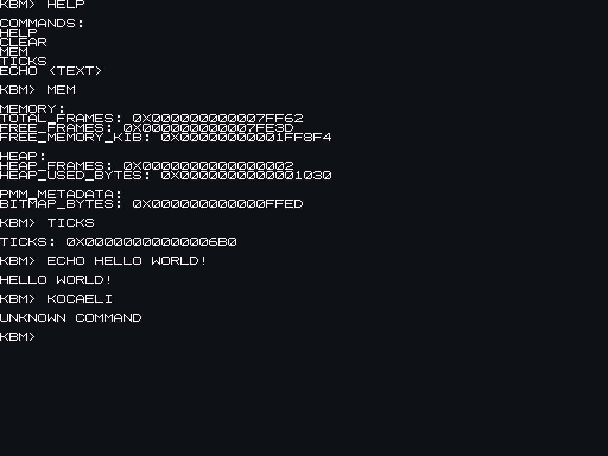

# KBM

KBM is a learning-focused x86-64 hobby kernel. It boots through Limine and is
being built to understand the path from firmware and CPU state to interrupts,
paging, memory management, and eventually a small interactive system.

It is deliberately not presented as a Linux or Windows replacement. The
current kernel is a documented bootstrap foundation whose behavior can be
observed in QEMU.

## Read the manual

- [Türkçe ayrıntılı el kitabı](docs/tr/INDEX.md)
- [Detailed English manual](docs/en/INDEX.md)
- [Manual structure and editorial plan](docs/MANUAL_PLAN.md)

The manuals follow the source tree from boot to `kmain`, GDT, IDT, the
PIC/PIT timer path, virtual memory, LAPIC MMIO mapping, the Limine memory map,
debugging, and the next milestones. They describe implemented behavior and
planned behavior separately.

## Current capabilities

- Limine boot into an x86-64 C kernel
- COM1 serial boot/error logging
- Minimal GDT and selected IDT exception handlers
- 8259 PIC remapping, PIT timer IRQ0, and timer tick counting
- LAPIC LINT0 setup through an explicitly mapped MMIO page
- CR3-based 4 KiB page-table inspection and virtual-to-physical translation
- Limine memory-map discovery plus a bitmap physical-frame allocator
- PMM ownership tracking, invalid-free checks, and a small 16-byte-aligned free-list heap with `kmalloc` and `kfree`
- Framebuffer text console with wrapping, scrolling, an 8×8 font, limited Turkish UTF-8 support, and PS/2 keyboard IRQ1
- Interactive `HELP`, `CLEAR`, `MEM`, `TICKS`, `UPTIME`, `ECHO`, `REBOOT`, and `KOCAELI` shell commands

KBM intentionally does not yet have mouse support, a filesystem, user mode,
processes, a scheduler, networking, or a custom bootloader.

## Screenshot

## Build and run

Install a GNU-compatible C toolchain, GNU Make, `xorriso`, and QEMU. Then:

~~~sh
make all
make run
~~~

For a serial-only QEMU session, useful while debugging:

~~~sh
make run-serial
~~~

The expected serial boot path includes markers such as `KBM_BOOT_OK`,
`KBM_IDT_LOADED`, `KBM_LAPIC_MMIO_MAPPED`, `KBM_PIT_TICKS`, and
`KBM_MEMMAP_ENTRIES`. See the manuals for the meaning and troubleshooting of
each marker. `run-serial` deliberately uses QEMU's `-no-reboot`, so a guest
`REBOOT` request closes QEMU instead of starting the guest again. Use `make run`
to test the framebuffer shell and the `REBOOT` command.
